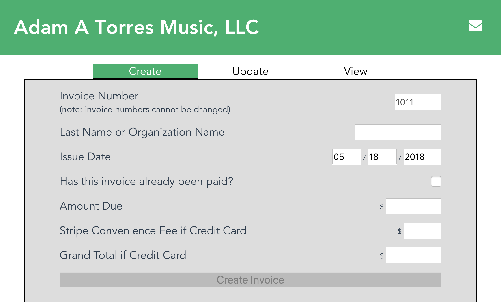

## See the app demo live!
* Visit https://invoice-management-app.surge.sh/#/ for the client view.
* Visit https://invoice-management-app.surge.sh/#/dashboard for the admin view.

To try it out, Stripe's test credit card is 4242 4242 4242 4242 with any future expiry date and any three-digit CVC.

## The Pitch
My fiance is a professional conductor, pianist, and teacher. In addition to being a full-time faculty member at Colorado State University, he does a TON of independent contract work, with a few orchestral conducting appointments, teaching piano lessons, and performing other miscellaneous theatre engagements. As a professional that does his volume of contract work, settling his books at various intervals is always a massive headache. That's where Clientelements (working title) comes in. Clientelements is an invoice management system that keeps records centralized for independent contractors. It saves clients the hassle of having to find the checkbook, envelopes, and stamps, while providing the peace of mind of Stripe's secure credit card processing service.

## How It Works
The Clientelements dashboard assists the contractor as they generate and send out their invoices. The "Create" feature brings up a short form that the contractor can fill in with the client name and amount due, while displaying the next invoice number sequentially and calculating Stripe's convenience fees (assuming the contractor will pass that expense on to the client). The "Update" feature makes it easy for the contractor to update their personal invoice database should clients choose to pay by cash or check, or should there be any typos. The "View" feature provides detailed records for the contractor to review as desired. Upon receiving their invoice, the client can look it up with their invoice number and last name to view the amount due and pay by credit card.

## Desktop View

## Local Installation
Fork and clone this repository. From the root of the repository, run `createdb invoice_reocrds && cd server && node app.js` and `cd ../client && npm start`. Note that you will need to have Node.js, Postgres, and psql installed on your local machine in order to run the app locally.

## Future Features
* Email receipts
* Invoice pdf generator
* Customer Contact Form

## License
MIT

## Contact
mjschreier1@gmail.com